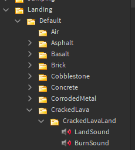

# CharacterSoundsController
A module for quick and easy character sounds including:
- Footsteps
- Jumping
- Landing

[Roblox Model](https://www.roblox.com/library/9925561505/CharacterSoundsController)

---
## Demo
 

---
## Setting up
Put the CharacterSoundsController anywhere the client can access it.
Preferrably somewhere in ReplicatedStorage.
And then put a LocalScript in StarterPlayerScripts and do the following:
```lua
require(game.ReplicatedStorage.CharacterSoundsController):Commence(true)
```
---
## Documentation
### Functions <br>
#### CharacterSoundsController:Commence
Starts the Controller. Set the first argument to true for auto player character wrapping.
```lua
function CharacterSoundsController:Commence(autoWrapPlayers: boolean): CharacterSoundsController
```

<br>

#### CharacterSoundsController:WrapCharacter
Wraps a character and gives it character sounds.
```lua
function CharacterSoundsController:WrapCharacter(character: Model): void
```
---
## Tutorials

### Making a new sound group
Firstly duplicate a copy of a SoundGroupTemplates inside the templates folder. <br>
 <br>
Now let's rename it into Sprint. Note that we will be using this SoundGroup in a later tutorial. <br>
 <br>
Now you can freely put sounds and [stacked sounds](https://github.com/Synthranger/CharacterSoundsController#making-stacked-sounds) inside the individual folders of this SoundGroup.

<br>

### Making stacked sounds
Just add a folder inside the material folder that you want stacked sounds to be. <br>

Possible use cases are:
- Having sounds of breaking bones alongside a normal landing sound
- Having sound of burning with the normal landing sound when landing on cracked lava material.

It should look like this: <br>


<br>

### Using hooks
In this section of Tutorials we will finally use the Sprint SoundGroup we did back [here](https://github.com/Synthranger/CharacterSoundsController#making-a-new-sound-group). <br>

This is what a hook should contain by default. (Some categories might have more arguments to use)
```lua
return function(character: Model, humanoid: Humanoid)
	return "Default"
end
```
A hook should return the name of the SoundGroup to be used when triggered. <br>
As you can see with the example below, it is a hook that changes the SoundGroup depending on the vertical velocity of the HumanoidRootPart.
```lua
return function(character: Model, humanoid: Humanoid)
	local rootPart: Part = character:WaitForChild("HumanoidRootPart")
	local verticalVelocity = rootPart.AssemblyLinearVelocity * Vector3.new(1, 0, 1)
	if verticalVelocity.Magnitude > 16 then
		return "Sprint"
	end
	return "Default"
end
```

<br>

### Using the Landing hook 
The landing hook has more arguments than the other categories so I made a separate section for it here. <br>
This is what it looks like by default:
```lua
return function(character: Model, humanoid: Humanoid, fallPosition: Vector3, landVelocity: Vector3)
	return "Default"
end
```
You can see that it has 2 more arguments, `fallPosition` and `landVelocity`, useful for detecting when to make bone crunching sounds like so:
```lua
return function(character: Model, humanoid: Humanoid, fallPosition: Vector3, landVelocity: Vector3)
	if landVelocity.Magnitude > 50 then
		return "BoneCrunch"
	end
	return "Default"
end
```
(You need to make a BoneCrunch SoundGroup for this to work)